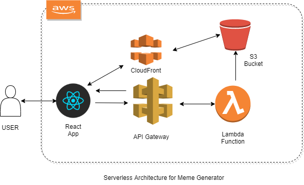

# Doge Meme Generator

### Serverless meme generator using Lambda Functions, AWS CloudFront, AWS S3,etc with React Framework. 

### Architecture Diagram:

### Implementation

### Snippets from the WebPage:

### Resources:
* [npm jimp package](https://www.npmjs.com/package/jimp)
* [AWS Lambda Function](https://docs.aws.amazon.com/lambda/latest/dg/getting-started.html)

This project was bootstrapped with [Create React App](https://github.com/facebook/create-react-app).

