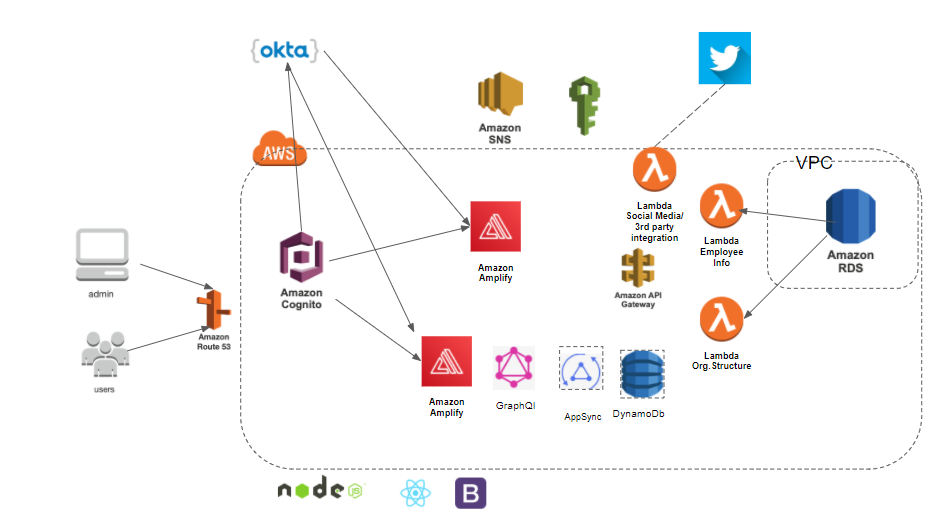

## CMPE 272 Enterprise Software Platform - Term Project  (Fall '20)
## Prof. Andrew Bond 
# Human Capital Management Platform

**Website: [Click here](https://master.d36s98jndilz0p.amplifyapp.com/login)**

### Team: Modular Monolith
### Team members:
```
* Allen Wu
* Anastasia Zimina
* Manjiri Kadam
* Pooja Prasannan
```

# Solution Description:
* We have implemented a default project In our project i.e. Human Capital Management Platform. We have imported the dumps provided by Prof in the secured AWS RDS MySQL database in a VPC. 
* Built the employee schema where information such as- Employee name, salary, hire data, manager, designation, and department, etc information is present.
Our project uses All AWS services - AWS RDS (MySQL), AWS Amplify, Lambda Functions, DynamoDB, Appsync, etc.
* In our platform, we have role based accesses where employees can see the basic information about themselves and colleagues. Managers can modify/ give raises to fellow employees. Admin can access all the information about employees and managers of different departments.
* We have a feedback portal for all employees where they can write feedback/ compliments to their peers.
* We have third party integration with Twitter service, where Managers can tweet about the employees success stories. Also from the feedback portal any employee can share their feedback socially with the help of Twitter.
* We have implemented Single Sign On with help of Okta( which is an SSO provider) and for secured authentication we have used AWS Cognito along with Okta, AWS Cognito was very useful for role based accesses.
* We have deployed our project on AWS Amplify which is a serverless deployment platform where we can connect it with Git Repo for Continuous Integration and Continuous Deployment (CI/CD). And it has AWS CloudFront features by default which helps to avoid latency.

# Use Case
This project is an example of **ERP software**. This solution can be used in any enterprise such as Schools, IT Jobs, Finance offices, etc to **Manage Employee data, to give promotions/ raises to employees and  for internal communication**.

# Architecture Diagram



# Technologies Used
* **AWS Cognito** for user authentication, authorization and role based access.
* **IAM roles and policies**, for secured gateway to RDS database.
* **AWS Lambda Functions**, to get information about employees from Secured RDS database by using SQL queries. 
* **API Gateway**, for secured datapoint (API) for the frontend
* **Amazon Amplify**, for deployment (CI/CD) of our application.
* **AWS RDS ( MySQL)**, to store employee database in highly secured VPC. with 6 Multi region multi AZ copies.
* **Okta**, for Single Sign On
* **GraphQL API**, to fetch and update the info in DynamoDb
* **DynamoDB**, to save feedback and metadata for feedback portal.
* **Appsync**, for creating DynamoDB schema (using Amplify cli)
* **Twitter Service**.
* **ReactJs, and React bootstrap** for frontend. **NodeJs** for backend.


**Thank you.**


This project was bootstrapped with [Create React App](https://github.com/facebook/create-react-app).
